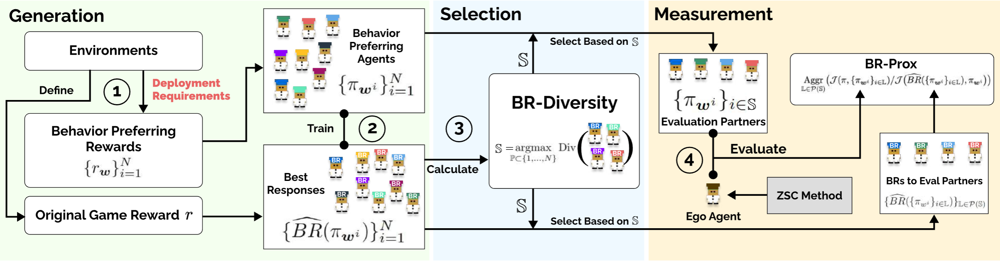
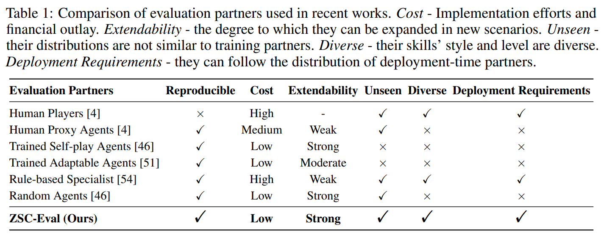
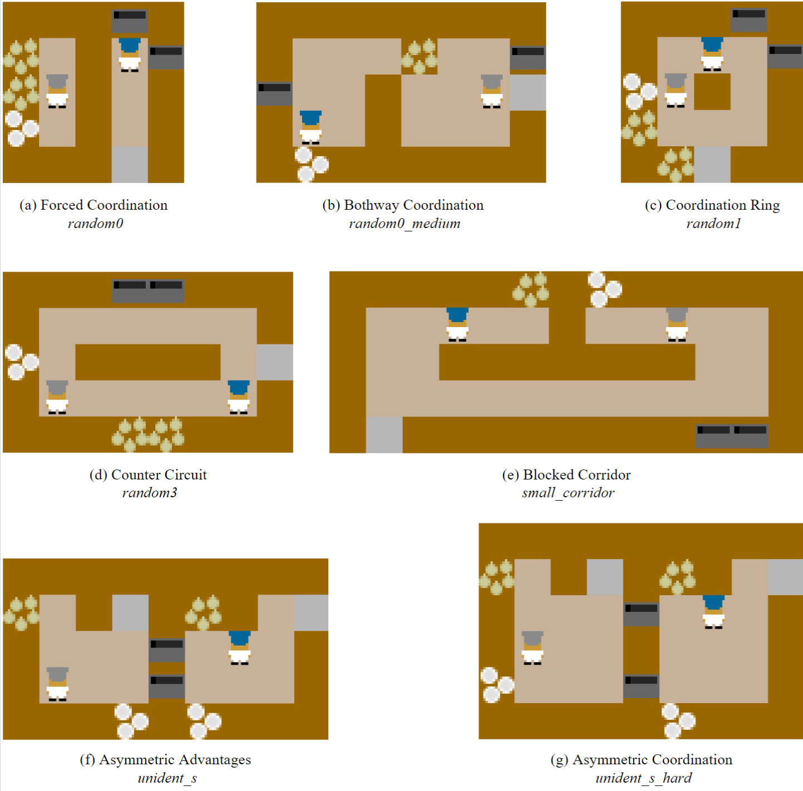
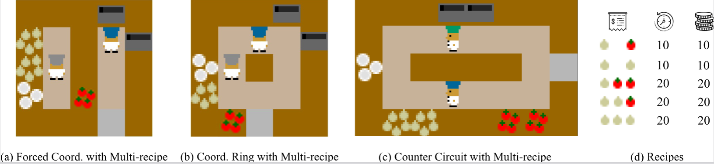
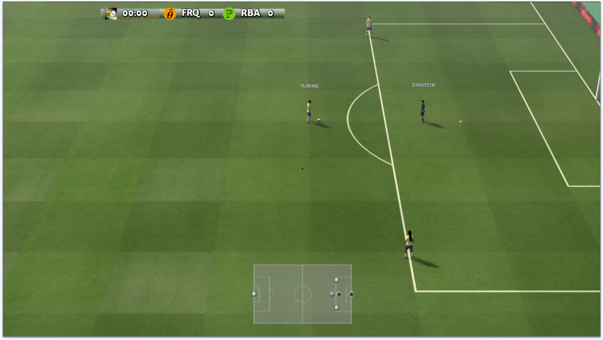
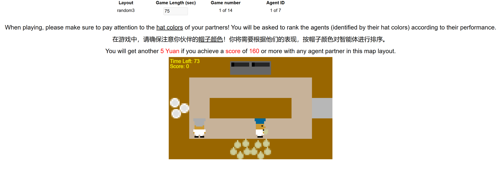
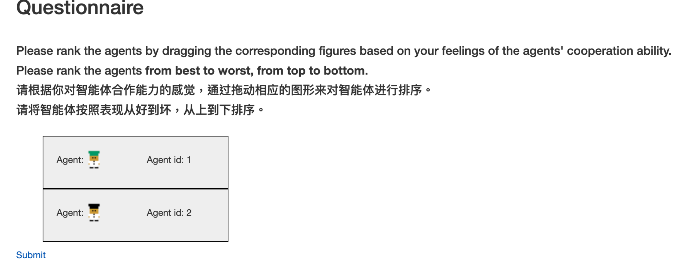
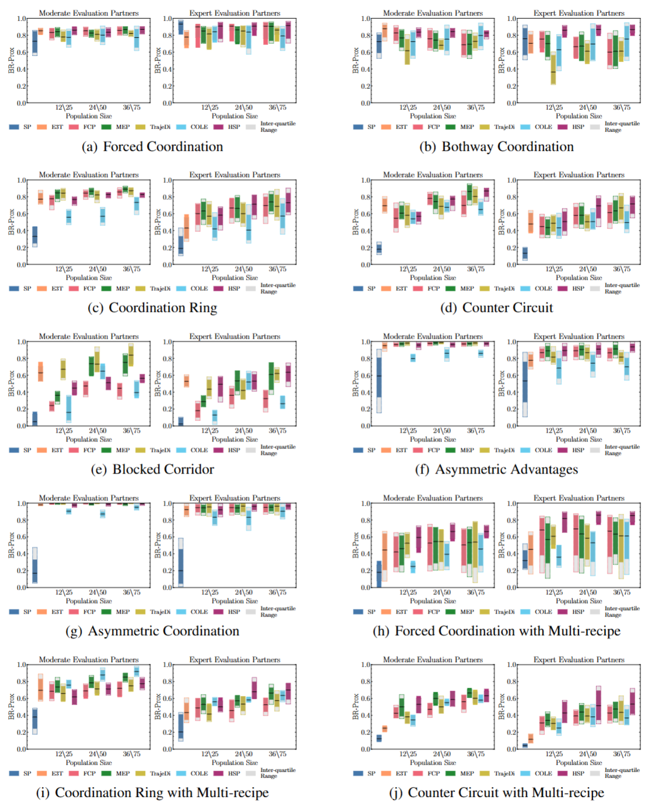
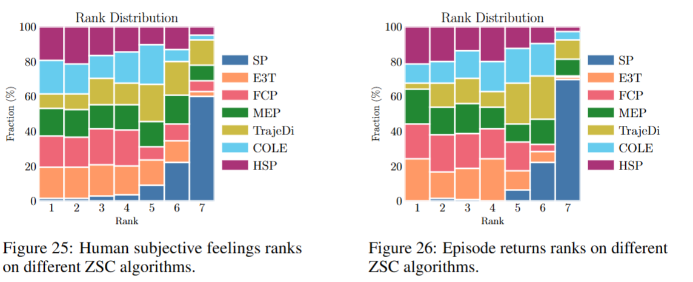
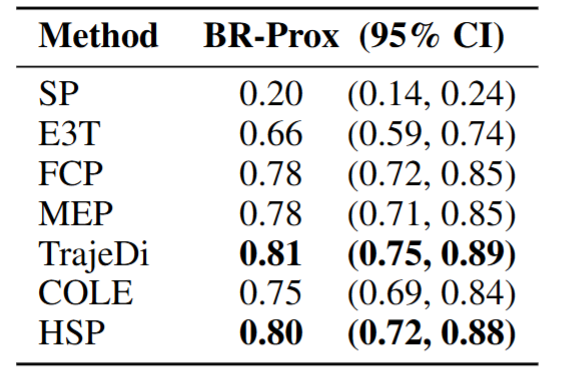

# NeurIPS 2024 D&B Track - ZSC-Eval: An Evaluation Toolkit and Benchmark for Multi-agent Zero-shot Coordination

[](https://deepwiki.com/sjtu-marl/ZSC-Eval)

## Overview
<div align=center>

</div>

This repository is the official implementation of [ZSC-Eval: An Evaluation Toolkit and Benchmark for Multi-agent Zero-shot Coordination](https://arxiv.org/abs/2310.05208).

ZSC-Eval is a comprehensive and convenient evaluation toolkit and benchmark for zero-shot coordination (ZSC) algorithms, including partner candidates generation via behavior-preferring rewards, partners selection via Best-Response Diversity (BR-Div), and ZSC capability measurement via Best-Response Proximity (BR-Prox).

<div align=center>

</div>


This repo includes:
- Evaluation Framework
    - Generation and Selection of Behavior-preferring Evaluation Partners
    - Measurement of ZSC capability via Best-Response Proximity and other metrics
- Environments Support
    - Overcooked-ai 🧑‍🍳
    - Overcooked-ai with Multiple Recipes 🧑‍🍳 (New Coordination Challenge!)
    - Google Research Football ⚽️
- ZSC Algorithms Implementation
    - [FCP: Fictitious Co-Play](https://arxiv.org/abs/2110.08176)
    - [MEP: Maximum Entropy Population-based training](https://arxiv.org/abs/2112.11701)
    - [TrajeDi: Trajectory Diversity PBT](https://proceedings.mlr.press/v139/lupu21a.html)
    - [HSP: Hidden-utility Self-Play](https://arxiv.org/abs/2302.01605)
    - [COLE: Cooperative Open-ended Learning](https://arxiv.org/abs/2302.04831)
    - [E3T: Efficient End-to-End Training](https://papers.nips.cc/paper_files/paper/2023/hash/07a363fd2263091c2063998e0034999c-Abstract-Conference.html)
    - [SP: Self-play](https://github.com/marlbenchmark/on-policy)
- A Human Study Platform
    - Real-time Overcooked game play
    - Subjective Ranking
    - Trajectories Collection
- Benchmarks
    - Benchmark of ZSC Algorithms under ZSC-Eval
    - Benchmark of ZSC Algorithms under Human Evaluation

## 🗺️ Supported Environments

### 🧑‍🍳 Overcooked

[Overcooked](https://github.com/HumanCompatibleAI/overcooked_ai) is a simulation environment for reinforcement learning derived from the Overcooked! video game and popular for coordination problems.

The Overcooked environment features a two-player collaborative game structure with shared rewards, where each player assumes the role of a chef in a kitchen, working together to prepare and serve soup for a team reward.

<div align=center>

</div>

We further include Overcooked games with multiple recipes, in which agents should decide the schedule of cooking different recipe for higher rewards.

<div align=center>

</div>


### ⚽️ Google Research Football

[Google Research Football (GRF)](https://github.com/google-research/football) is a simulation environment for reinforcement learning based on the popular football video game.
We choose the Football *Academy 3 vs. 1 with Keeper* scenario and implement it as a ZSC challenge.

<div align=center>

</div>


## 📖 Installation

To install requirements:

**ZSC-Eval and Overcooked**
```shell
conda env create -f environment.yml
```

**Google Research Football**
```shell
./install_grf.sh
```

## 📝 How to use ZSC-Eval for Evaluating ZSC Algorithms

After installation, here is the steps to use ZSC-Eval for evaluating the ZSC algorithms. We use the Overcooked Environment as an example.

```shell
cd zsceval/scripts/overcooked
```

### Setup the Policy Config

gen policy_config for each layout
```shell
bash shell/store_config.sh {layout}
#! modify the layout names
bash shell/mv_policy_config.sh
```

**An Example of policy_config**

[Policy Config Example](assets/policy_config.example)

### Prepare the Evaluation Partners

1. train behavior-preferring agents
```shell
bash shell/train_bias_agents.sh {layout}
```
2. extract agent models
```shell
cd ..
python extract_models/extract_bias_agents_models.py {layout}
python prep/gen_bias_agent_eval_yml.py {layout}
cd overcooked
```
3. evaluate the agents and get policy behaviors
```shell
bash shell/eval_bias_agents_events.sh {layout}
```
4. select evaluation partners and generate evaluation ymls
```shell
cd ..
python prep/select_bias_agent_br.py --env overcooked --layout {layout} --k 10 --N 1000000
```

Copy the results in `zsceval/scripts/prep/results/{layout}` to `zsceval/utils/bias_agent_vars.py`.

Generate benchmark yamls:

```shell
python prep/gen_bias_agent_benchmark_yml.py -l {layout}
```

5. train BRs for mid-level biased agents
```shell
cd overcooked
bash shell/train_bias_agents_br.bash {layout}
```

### Evaluate the ZSC Agents

We using the most common baseline, FCP, as an example.

1. evaluate S2 models
```shell
#! modify the exp names
bash shell/eval_with_bias_agents.sh {layout} fcp
```
2. compute final results
```shell
#! modify the exp names
cd ..
python eval/extract_results.py -a {algo} -l {layout}
```


## 🏋️ Train ZSC Algorithms

We re-implement FCP, MEP, TrajeDi, HSP, COLE and E3T as the baselines in ZSC-Eval.
To train these ZSC methods, please follow the guide below:

First, replace `"your wandb name"` with your wandb username for convenience experiments management.

### Train FCP

**Stage 1**

1. train self-play agents
```shell
cd overcooked
bash shell/train_sp.sh {layout}
```
2. extract models
```shell
cd ..
#! modify the exp names
python extract_models/extract_sp_models.py {layout} overcooked
```
**Stage 2**
1. generate S2 ymls
```shell
#! modify the exp names
python prep/gen_S2_yml.py {layout} fcp
```
2. train S2
```shell
cd overcooked
#! modify the exp names
bash shell/train_fcp_stage_2.sh {layout} {population_size}
```
3. extract S2 models
```shell
cd ..
#! modify the exp names
python extract_models/extract_S2_models.py {layout} overcooked
```

### Train MEP | TrajeDi

**Stage 1**

1. generate Stage 1 population yml
```shell
python prep/gen_pop_ymls.py {layout} [mep|traj] -s {population_size}
```
2. train S1
```shell
cd overcooked
bash train_[mep|traj]_stage_1.sh {layout} {population_size}
```
3. extract S1 models
```shell
cd ..
#! modify the exp names
python extrace_models/extract_pop_S1_models.py {layout} overcooked
```

**Stage 2**

1. generate S2 yamls
```shell
#! modify the exp names
python prep/gen_S2_yml.py {layout} [mep|traj]
```
2. train S2
```shell
cd overcooked
#! modify the pop names
bash shell/train_[mep|traj]_stage_2.sh {layout} {population_size}
```
3. extract S2 models
```shell
cd ..
#! modify the exp names
python extract_models/extract_S2_models.py {layout} overcooked
```

### Train HSP
1. generate S2 ymls
```shell
python prep/gen_hsp_S2_ymls.py -l ${layout} -k {num_bias_agents} -s {mep_stage_1_population_size} -S {population_size}
```
2. train S2
```shell
cd overcooked
bash shell/train_hsp_stage_2.sh {layout} {population_size}
```
3. extract S2 models
```shell
#! modify the exp names
python extract_models/extract_S2_models.py {layout} overcooked
```

### Train COLE

1. generate COLE ymls

```shell
python prep/gen_cole_ymls.py {layout} -s {population_size}
```

2. train COLE
```shell
cd overcooked
bash shell/train_cole.sh {layout} {population_size}
```

3. extract S2 models
```shell
cd ..
#! modify the exp names
python extract_models/extract_S2_models.py {layout} overcooked
```

### Train E3T

```shell
cd overcooked
bash shell/train_e3t.sh {layout}
```

We use the `random3_m` layout in Overcooked as an example for all generated yamls and models (.pt). The files are in [random3_m](https://huggingface.co/Leoxxxxh/ZSC-Eval-policy_pool/tree/main/random3_m).

## 🤖 Pre-trained Models

We also provide the pre-trained models for these baselines, you can download pre-trained models from [huggingface](https://huggingface.co/Leoxxxxh/ZSC-Eval-policy_pool):

```shell
cd zsceval
git clone https://huggingface.co/Leoxxxxh/ZSC-Eval-policy_pool policy_pool
```

## 👩🏻‍💻 Human Study

We implement a human study platform, including game-playing, subjective ranking, and data collection. Details can be found in [zsceval/human_exp/README.md](zsceval/human_exp/README.md).

### Web UIs
#### Game-playing
<div align=center>

</div>

#### Ranking
<div align=center>

</div>


### Deployment

#### Debug Mode
```shell
export POLICY_POOL="zsc_eval/policy_pool"; python zsc_eval/human_exp/overcooked-flask/app.py
```
#### Production Mode
```shell
bash zsc_eval/human_exp/human_exp_up.sh
```

## 🛠️ Code Structure Overview

`zsceval` contains:

`algorithms/`:
- `population/`: trainers for population-based ZSC algorithms
- `r_mappo/`: trainers for self-play based algorithms, including SP and E3T

`envs/`:
- `overcooked/`: overcooked game with single recipe
- `overcooked_new/`: overcooked game with mutiple recipe
- `grf/`: google research football game

`runner/`: experiment runers for each environment

`utils/`:
- `config.py`: basic configuration
- `overcooked_config.py`: configuration for overcooked experimenets
- `grf_config.py`: configuration for grf experimenets

`policy_pool/`: training, evaluation yamls and agent models

`human_exp/`: human study platform

`scripts/`
- `prep/`: generate yamls for training
    - `select_bias_agent_br.py`: select evaluation partners
- `extract_models/`: code for extracting trained agent models
- `render/`: environment rendering
- `overcooked/`: scripts for training and evaluating overcooked agents
    - `eval/`: python scripts for evaluation and extraction evaluation results
        - `results`: benchmark results
    - `shell/`: shell scripts for training and evaluating agents
    - `train/`: python training scripts for each algorithm
- `grf/`: scripts for training and evaluating grf agents
    - `eval/`: python scripts for evaluation and extraction evaluation results
        - `results`: benchmark results
    - `shell/`: shell scripts for training and evaluating agents
    - `train/`: python training scripts for each algorithm

## ⚒️ How to Extend ZSC-Eval to New Environments

Firstly, the new environments should have consistent interfaces with those in [Gym](https://gymnasium.farama.org/). Then **2 key steps** are required for generating evaluation partners:

- Design events that cover *common behaviors* in the new environment and implement event triggers for recording these events.
- Implement reward calculation using linear combinations of event records and event weights, and design weights that cover *common preferences* in the new environment.

We use GRF as an example to provide guidelines for including new environments in ZSC-Eval.

The GRF environment is integrated in `zsceval/envs/grf/`:

- `grf_env.py`: the environment wrapper to provide consistent interface with Gym.
- `scenarios/`: ZSC scenarios.
- **`reward_process.py`**: event-based reward shaping.
- **`stats_process.py`**: pre-defined events recording.
- `raw_feature_process.py`: observation processing for GRF, based on https://github.com/jidiai/GRF_MARL .
- `multiagentenv.py`: abstract interface

**`reward_process.py`** and **`stats_process.py`** are two key modifications to include GRF in ZSC-Eval.

We argue that ZSC focuses on high-level strategies instead of low-level operations, and thus use some common statistical variables as events, including:

```python
SHAPED_INFOS = [
    "pass",
    "actual_pass",
    "shot",
    "slide",
    "catch",
    "assist",
    "possession",
    "score",
]
```
`stats_process.py` implements triggers for each event and records the occurrence of these events, which is used in `reward_process.py`. `reward_process.py` receives user designated weights of the events, and competes the rewards that indicating behavior preferences using linear combinations. An example of a weights set is:

```shell
w0="[-5:0:1],0,[-5:0:1],0,[-5:0:1],0,0,[1:5]"
```

`w0` indicates `38` event weight vectors, under the constraints that each weight vector has at most `3` preferred behaviors (`3` non-zero weight), as shown in the following:

```plain
1: [-5.0, 0.0, -5.0, 0.0, 0.0, 0.0, 0.0, 1.0]
2: [-5.0, 0.0, -5.0, 0.0, 0.0, 0.0, 0.0, 5.0]
3: [-5.0, 0.0, 0.0, 0.0, -5.0, 0.0, 0.0, 1.0]
4: [-5.0, 0.0, 0.0, 0.0, -5.0, 0.0, 0.0, 5.0]
5: [-5.0, 0.0, 0.0, 0.0, 0.0, 0.0, 0.0, 1.0]
6: [-5.0, 0.0, 0.0, 0.0, 0.0, 0.0, 0.0, 5.0]
7: [-5.0, 0.0, 0.0, 0.0, 1.0, 0.0, 0.0, 1.0]
8: [-5.0, 0.0, 0.0, 0.0, 1.0, 0.0, 0.0, 5.0]
9: [-5.0, 0.0, 1.0, 0.0, 0.0, 0.0, 0.0, 1.0]
10: [-5.0, 0.0, 1.0, 0.0, 0.0, 0.0, 0.0, 5.0]
11: [0.0, 0.0, -5.0, 0.0, -5.0, 0.0, 0.0, 1.0]
12: [0.0, 0.0, -5.0, 0.0, -5.0, 0.0, 0.0, 5.0]
13: [0.0, 0.0, -5.0, 0.0, 0.0, 0.0, 0.0, 1.0]
14: [0.0, 0.0, -5.0, 0.0, 0.0, 0.0, 0.0, 5.0]
15: [0.0, 0.0, -5.0, 0.0, 1.0, 0.0, 0.0, 1.0]
16: [0.0, 0.0, -5.0, 0.0, 1.0, 0.0, 0.0, 5.0]
17: [0.0, 0.0, 0.0, 0.0, -5.0, 0.0, 0.0, 1.0]
18: [0.0, 0.0, 0.0, 0.0, -5.0, 0.0, 0.0, 5.0]
19: [0.0, 0.0, 0.0, 0.0, 0.0, 0.0, 0.0, 1.0]
20: [0.0, 0.0, 0.0, 0.0, 0.0, 0.0, 0.0, 5.0]
21: [0.0, 0.0, 0.0, 0.0, 1.0, 0.0, 0.0, 1.0]
22: [0.0, 0.0, 0.0, 0.0, 1.0, 0.0, 0.0, 5.0]
23: [0.0, 0.0, 1.0, 0.0, -5.0, 0.0, 0.0, 1.0]
24: [0.0, 0.0, 1.0, 0.0, -5.0, 0.0, 0.0, 5.0]
25: [0.0, 0.0, 1.0, 0.0, 0.0, 0.0, 0.0, 1.0]
26: [0.0, 0.0, 1.0, 0.0, 0.0, 0.0, 0.0, 5.0]
27: [0.0, 0.0, 1.0, 0.0, 1.0, 0.0, 0.0, 1.0]
28: [0.0, 0.0, 1.0, 0.0, 1.0, 0.0, 0.0, 5.0]
29: [1.0, 0.0, -5.0, 0.0, 0.0, 0.0, 0.0, 1.0]
30: [1.0, 0.0, -5.0, 0.0, 0.0, 0.0, 0.0, 5.0]
31: [1.0, 0.0, 0.0, 0.0, -5.0, 0.0, 0.0, 1.0]
32: [1.0, 0.0, 0.0, 0.0, -5.0, 0.0, 0.0, 5.0]
33: [1.0, 0.0, 0.0, 0.0, 0.0, 0.0, 0.0, 1.0]
34: [1.0, 0.0, 0.0, 0.0, 0.0, 0.0, 0.0, 5.0]
35: [1.0, 0.0, 0.0, 0.0, 1.0, 0.0, 0.0, 1.0]
36: [1.0, 0.0, 0.0, 0.0, 1.0, 0.0, 0.0, 5.0]
37: [1.0, 0.0, 1.0, 0.0, 0.0, 0.0, 0.0, 1.0]
38: [1.0, 0.0, 1.0, 0.0, 0.0, 0.0, 0.0, 5.0]
```

The `38` weight vectors cover common preferences of football players in GRF, which is essential in evaluating ZSC capability.

Although the new environments may be complex, the triggers of events are relatively easy to implement and the high-level events and their weights are convenient to design. **We call for suggestions about new multi-agent ZSC environments and are happy to include them in ZSC-Eval**.


## Benchmark Results

### Overcooked
Overall ZSC-Eval benchmark results in Overcooked.

<div align=center>

</div>

Human benchmark results in Overcooked.

<div align=center>

</div>


### GRF
Overall ZSC-Eval benchmark results in GRF.

<div align=center>

</div>

## Citation
```
@inproceedings{wang2024zsc,
  title={Zsc-Eval: An Evaluation Toolkit and Benchmark for Multi-agent Zero-shot Coordination},
  author={Wang*, Xihuai and Zhang*, Shao and Zhang, Wenhao and Dong, Wentao and Chen, Jingxiao and Wen, Ying and Zhang, Weinan},
  booktitle={The Thirty-eight Conference on Neural Information Processing Systems Datasets and Benchmarks Track},
  year={2024}
}
```

## Acknowledgements

We implement algorithms heavily based on https://github.com/samjia2000/HSP , and human study platform based on https://github.com/liyang619/COLE-Platform.
